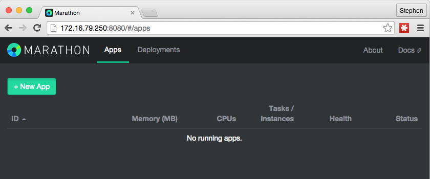
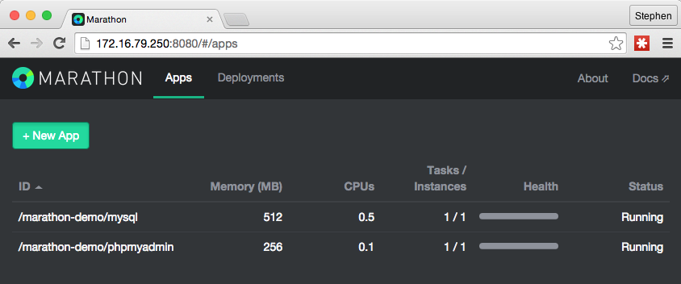
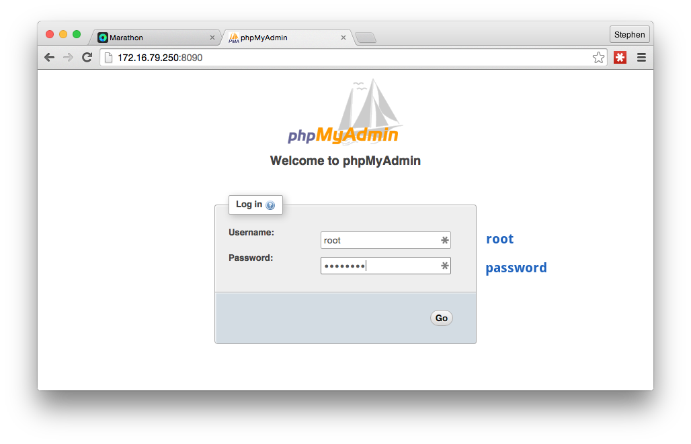
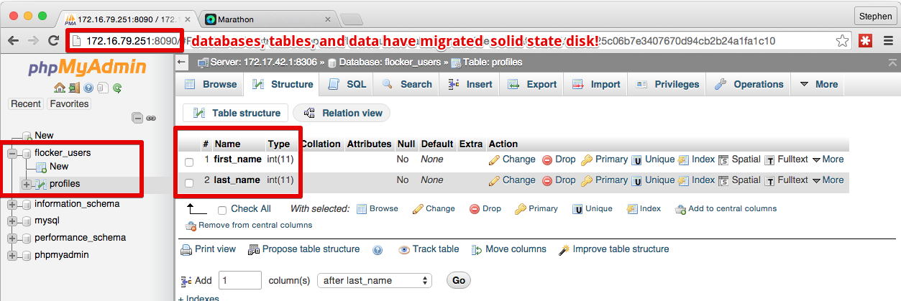

## Marathon w/ Flocker Plugin Demo
A demo of migrating a MySQL/PHPMyAdmin constrained on a spinning disk to solid state disks utilizing Marathon and the Docker Flocker volume driver.

Prerequisites : 
- [Install Vagrant](https://www.virtualbox.org/)
- [Install VirtualBox](https://www.virtualbox.org/)

### 1. Start your vagrant environment

```bash
$ vagrant up
```

Then navigate to http://172.16.79.250:8080/ - you will see a empty Marathon interface with no application group deployed. Lets change that.



### 2. Deploy a Marathon application group

To deploy Marathon application group we'll use the built in Rest API passing in our application group manifest located at [app/application-group-spinning-disk.json](ClusterHQ/marathon-flocker-plugin-demo/app/application-group-spinning-disk.json)

notable parameters in our manifest
- the `volume-driver` set to `flocker`
- volume at `mesosdemo:/var/lib/mysql`
- a Marathon cluster disk [constraint](https://mesosphere.github.io/marathon/docs/constraints.html#cluster-operator) of `spinning` disk */we'll we migrating our data from these volumes onto for performant ssd drives/*

The volume being established in this instance is a copy on write ZFS volume that flocker will eventually to migrate in the next few steps.

```json
// app/application-group-spinning-disk.json
...
        "parameters": [{
          "key": "volume-driver",
          "value": "flocker"
        },{
          "key": "volume",
          "value": "mesosdemo:/var/lib/mysql"
        }],
...
    "constraints": [
      ["disk", "CLUSTER", "spinning"]
    ]
```


#### The Marathon App Groups API [`POST /V2/groups`](https://mesosphere.github.io/marathon/docs/rest-api.html#post-v2-groups)

```bash
$ curl -i -H 'Content-type: application/json' --data @app/application-group-spinning-disk.json http://172.16.79.250:8080/v2/groups
```


Then navigate to http://172.16.79.250:8090/ and you will see the familiar PHPMyAdmin Interface. Login with `root:password`


proceed to insert some databases, tables, and data


### Migrate the MySQL data volume to ssd drives

Now lets remove the application group and redeploy the application group with a new application constraint from `["disk", "CLUSTER", "spinning"]` to `["disk", "CLUSTER", "ssd"]`. This does not destroy the mysql volume (`mesosdemo:/var/lib/mysql`) that we have established.

```bash
$ curl -X DELETE http://172.16.79.250:8080/v2/groups/marathon-demo?force=true
# redeploy our application group with updated manifest
$ curl -i -H 'Content-type: application/json' --data @app/application-group-ssd-disk.json http://172.16.79.250:8080/v2/groups
```

Flocker behind the scenes automagically migrates the data volume (`mesosdemo:/var/lib/mysql`) from our spinning drive constrained node to a node with solid state drives. Voila!

navigate to our new node at http://172.16.79.251:8090/ in a browser, login once more, and your data is there.



Your data volume will always be there following your application in tandem with changes in your Marathon configuration.


### build box

To build the box the Vagrantfile is based on:

```
$ make box
```


### Feedback
 We’d love to hear feedback. open up a issue or feel free to join the discussion

- Email: [support@clusterhq.com](mailto:support@clusterhq.com)
- IRC: [#clusterhq](irc://freenode.net/clusterhq) on freenode
- Google Group: [Flocker Users Google Group](https://groups.google.com/forum/#!forum/flocker-users)